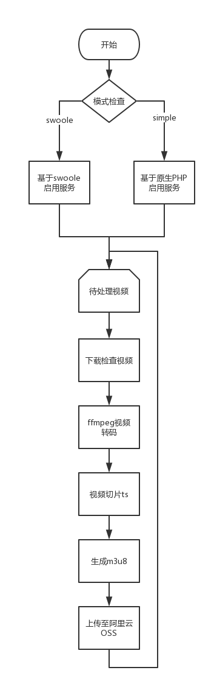

#php4hls

本项目使用PHP实现，采用ffmpeg对视频进行转码、切片、打包；基于HLS，将视频处理为m3u8索引文件、ts视频文件、mp4源文件三部分。

前端借助于视频播放器（原生html5、jwplayer等）可以实现视频播放。

服务端基于PHP-Swoole实现稳定服务化，也可以采用CLI执行PHP脚本的方式，在不添加任何额外扩展的情况下满足小型项目的需求。

## 技术选型

1. PHP
2. JavaScript
3. ffmpeg

## 第三方依赖

###必需

1. ffmpeg
2. m3u8-segmenter

### 可选

1. PHP-Swoole（稳定服务化）
2. jwplayer（多版本兼容，订制化客户端）

## 服务流程

## 服务组件

### 核心组件

1. 模式（simple还是swoole）
2. 任务（任务投递与任务发现）
3. 文件（目标文件找寻/下载与存储/上传）
4. 视频（视频格式、清晰度、码率等）
5. 转码（视频转码专属）
6. 切片（视频切片ts、m3u8生成）

### 模式组件

1. simple模式
2. swoole模式

###其他组件

1. 阿里云OSS（视频下载及上传）

> **Note:**
>
> 后期会根据需求追加更多其他组件

## 播放器

1. html5
2. jwplayer

> **PS：**
>
> 本服务仅支持Linux，不对Windows进行兼容。